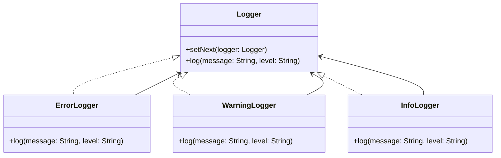

# Chain of Responsibility

## Intent
To allow multiple objects to handle a request without the sender specifying the receiver, by chaining handlers sequentially.

## Motivation
Consider a logging system with multiple levels: debug, info, warning, and error. Instead of hardcoding conditions to determine which logger should process a message, we can use the Chain of Responsibility pattern to dynamically pass the message along a chain of loggers until one handles it.

For example, without Chain of Responsibility, we might have:
```java
public class Logger {
    public void log(String message, String level) {
        if (level.equals("ERROR")) {
            System.out.println("Error: " + message);
        } else if (level.equals("WARNING")) {
            System.out.println("Warning: " + message);
        } else {
            System.out.println("Info: " + message);
        }
    }
}
```

This approach is not flexible and makes it difficult to extend logging behavior. The Chain of Responsibility pattern allows dynamic chaining of handlers.

## When to use
Use Chain of Responsibility when:
* You want to decouple senders and receivers, allowing multiple handlers to process a request.
  * **Example**: A logging system that processes messages at different severity levels.
* You want to dynamically determine which handler processes a request.
  * **Example**: A request validation system where different validators execute in sequence.

## Structure



## Participants
* Handler (`Logger`): Defines an interface for handling log messages and optionally passing them to the next logger.
* Concrete handlers (`ErrorLogger`, `WarningLogger`, `InfoLogger`): Implements request processing and decides whether to forward the request to the next logger.
* Client:  Initiates the logging request and forwards it to the first logger in the chain.

## Pros and Cons

| ✅ Pros                                                                                                     | ❌ Cons                                                                                         |
| ---------------------------------------------------------------------------------------------------------- | ---------------------------------------------------------------------------------------------- |
| **Decouples sender and receiver**: The sender doesn't need to know which handler will process the request. | **Can lead to unhandled requests**: If no handler processes the request, it might be lost.     |
| **Flexible and extensible**: Handlers can be added or removed dynamically.                                 | **Debugging complexity**: Tracking the flow of a request can be harder with multiple handlers. |
| **Promotes single responsibility**: Each handler focuses on a specific concern.                            | **Potential performance cost**: If the chain is long, processing may take time.                |


## How to implement
1. Define an abstract handler: Create a base class that defines request handling and chaining behavior.
2. Implement concrete handlers: Extend the base class and implement request processing logic.
3. Link handlers together: Ensure handlers are connected in a sequence where each passes unhandled requests to the next.
4. Use the chain: Pass requests to the first handler and let the chain process them dynamically.