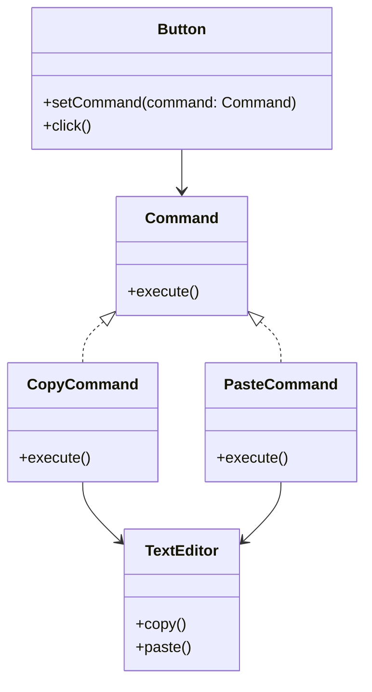

# Command

## Intent
To encapsulate a request as an object, allowing parameterization of clients, queuing of requests, and logging of executed operations.

## Motivation

Consider a text editor with multiple actions like copy, paste, and undo. Instead of directly invoking these actions, we can use the Command pattern to encapsulate each action as an object. This enables features like undo/redo functionality by maintaining a history of executed commands.

For example, without Command, we might have:
```java
public class TextEditor {
    public void copy() {
        System.out.println("Copying text");
    }

    public void paste() {
        System.out.println("Pasting text");
    }
}
```

## When to use

Use Command when:

- You need to **decouple senders and receivers** so that commands can be executed at different times.  
  - **Example**: A graphical UI where buttons execute actions without knowing the receiver.  
- You want to **implement undo/redo functionality** by storing executed commands.  
  - **Example**: A text editor where users can undo multiple actions.  
- You need to **queue or schedule requests** for execution.  
  - **Example**: A task scheduler that executes commands at a later time.  

## Structure



## Participants

- **Command (`Command`)**: Declares an interface for executing a request.  
- **Concrete Commands (`CopyCommand`, `PasteCommand`)**: Implements the `execute()` method and invokes actions on the receiver.  
- **Receiver (`TextEditor`)**: Performs the actual work when a command is executed.  
- **Invoker (`Button`)**: Stores a command and triggers its execution.  
- **Client**: Creates concrete command objects and assigns them to the invoker.  

## Pros and Cons

| ✅ Pros                                                                                      | ❌ Cons                                                                 |
| ------------------------------------------------------------------------------------------- | ---------------------------------------------------------------------- |
| **Decouples sender and receiver**: Commands can be changed dynamically.                     | **Increases complexity**: Adds extra classes for each command.         |
| **Supports undo/redo**: Commands can be stored and reversed.                                | **Can lead to excessive command objects**: If too many commands exist. |
| **Allows request logging and queuing**: Useful for macro recording and scheduling tasks.    | **Performance overhead**: Maintaining command history can use memory.  |

## How to implement

1. **Define a Command interface** with an `execute()` method.  
2. **Implement Concrete Commands** that encapsulate requests for specific actions.  
3. **Create a Receiver** that executes the actual logic.  
4. **Implement an Invoker** that triggers commands dynamically.  
5. **Use the Command pattern** to execute actions without tightly coupling sender and receiver.  
