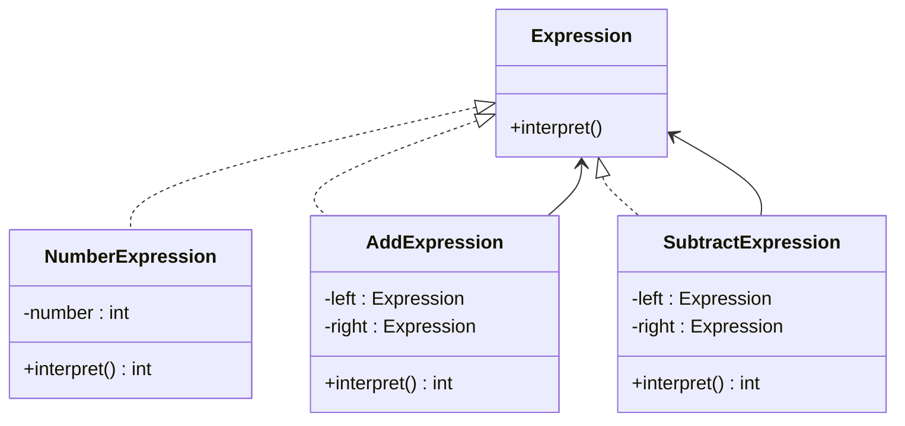

# Interpreter

## Intent

To define a grammar for a language and provide an interpreter to process and evaluate sentences in that language.

## Motivation

Consider a system that processes mathematical expressions like `5 + 3 - 2`. Instead of hardcoding the evaluation logic, we can define an Abstract Syntax Tree (AST) where each node represents a number or an operation. The Interpreter pattern allows us to evaluate these expressions dynamically by traversing the tree.

## When to use
Use the Interpreter pattern when:

* You need to define a simple language or grammar and evaluate expressions dynamically.
  * **Example**: A calculator that evaluates arithmetic expressions.
* You want to represent sentences in a language as an Abstract Syntax Tree.

## Structure

## Participants

* **AbstractExpression (`Expression`)**: Defines the interface for interpreting expressions.
* **TerminalExpression (`NumberExpression`)**: Represents a number and directly returns its value.
* **NonTerminalExpression (`AddExpression`, `SubtractExpression`)**: Implements operations and recursively evaluates subexpressions.
* **Client (`Calculator`)**: Builds the AST and invokes the interpretation process.

## Pros and Cons

| ✅ Pros                                          | ❌ Cons                                        |
|-------------------------------------------------|-----------------------------------------------|
| **Flexible**: Easily extendable for new expressions. | **Performance overhead**: Recursively parsing expressions can be slow. |
| **Encapsulates grammar**: Defines a structured way to evaluate expressions. | **Hard to scale**: Becomes complex for large or advanced languages. |
| **Good for small scripting languages**. | **Better alternatives exist**: For complex languages, compilers and parsers work better. |

## How to implement

1. **Define an abstract `Expression` class**: Include a method like `interpret()` to evaluate expressions.
2. **Create terminal expressions (`NumberExpression`)**: Directly return a fixed value.
3. **Create non-terminal expressions (`AddExpression`, `SubtractExpression`)**: Perform operations and interpret subexpressions.
4. **Build an expression tree (AST) in the client**: Parse input and construct a tree of expressions.
5. **Interpret the expression tree**: Call `interpret()` on the root node.
