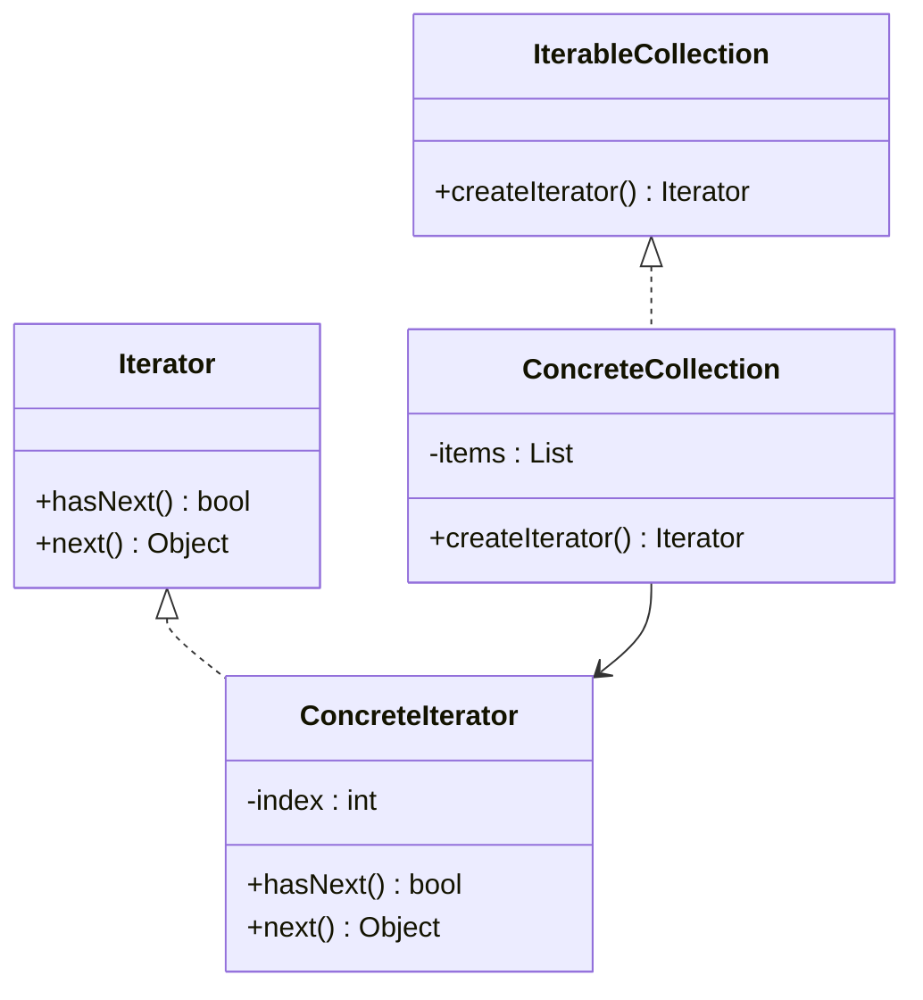

# Iterator

## Intent

To provide a way to access elements of a collection sequentially without exposing its underlying representation.

## Motivation

Consider a collection like a list or a tree. If we directly access its internal structure, it creates tight coupling between the collection and the client code. Instead, we can use the Iterator pattern to provide a consistent way to traverse elements, regardless of the collection type.

For example, without an iterator:

```java
List<String> items = new ArrayList<>();
items.add("A");
items.add("B");
items.add("C");

for (int i = 0; i < items.size(); i++) {
    System.out.println(items.get(i));
}
```

This approach exposes the internal structure (`size()`, `get()`) and requires different traversal logic for different collections.

Using iterator, we can unify traversal:

```java
Iterator<String> iterator = items.iterator();
while (iterator.hasNext()) {
    System.out.println(iterator.next());
}
```

## When to Use

Use the Iterator pattern when:

- You need to traverse a collection without exposing its internal representation.
  - **Example**: Iterating over a binary tree or graph without revealing its nodes' storage.
- You want to provide different ways to traverse a collection.
  - **Example**: Forward, backward, or filtered iteration.
- You need a uniform traversal interface across different collection types.
  - **Example**: Iterating through arrays, lists, and hash tables using the same interface.

## Structure



## Participants

- **Iterator (`Iterator`)**: Defines methods to traverse a collection (`hasNext()`, `next()`).
- **Concrete Iterator (`ConcreteIterator`)**: Implements iteration logic, keeping track of position.
- **Collection (`IterableCollection`)**: Defines method to create an iterator (`createIterator()`).
- **Concrete Collection (`ConcreteCollection`)**: Implements `createIterator()`, returning an instance of `ConcreteIterator`.

## Pros and Cons

| ✅ Pros                                      | ❌ Cons                                    |
|---------------------------------------------|-------------------------------------------|
| **Encapsulates traversal logic**: Client doesn’t need to know collection internals. | **Increased complexity**: Adds additional classes. |
| **Supports multiple traversal methods**: E.g., forward, backward, filtering. | **May not be optimal**: Performance overhead for simple collections. |
| **Uniform interface**: Works across different data structures. | **Concurrency issues**: Modifying a collection during iteration can cause errors. |

## How to Implement

1. **Create an `Iterator` interface**: Define `hasNext()` and `next()`.
2. **Implement a concrete iterator (`ConcreteIterator`)**: Store the current position and define traversal logic.
3. **Define a `Collection` interface**: Add `createIterator()` to return an iterator.
4. **Implement a concrete collection (`ConcreteCollection`)**: Store elements and return a `ConcreteIterator`.
5. **Use the iterator in client code**: Iterate over collections without exposing their internals.
