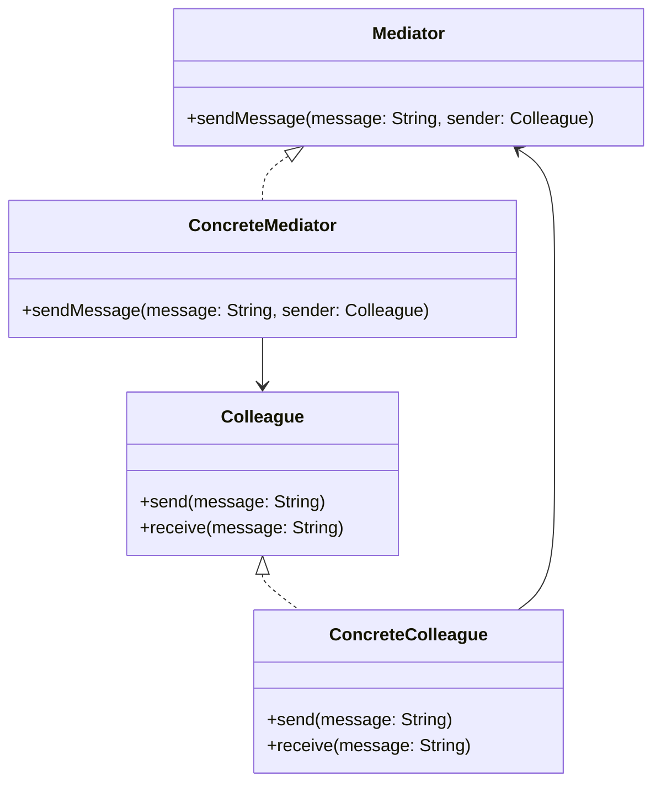

# Mediator

## Intent

To define an object that centralizes communication between multiple objects, promoting loose coupling.

## Motivation

Consider a chat room where multiple users can send messages to each other. Without a mediator, each user would have to keep track of all other users and send messages individually, leading to complex dependencies.

With the Mediator pattern, a central chat room (`ChatMediator`) handles message distribution, so users only interact with the mediator.

Without Mediator:

```java
public class User {
    private List<User> contacts;

    public void sendMessage(String message) {
        for (User user : contacts) {
            user.receiveMessage(message);
        }
    }
}
```
This tightly couples users together. Instead, a mediator can centralize this interaction.

## When to Use

Use the Mediator pattern when:

- You want to reduce direct dependencies between multiple objects.
  - **Example**: A chat system where users communicate through a chat room.
- You need to centralize communication logic.
- You want to promote single responsibility by encapsulating complex communication.

## Structure



## Participants

- **Mediator (`Mediator`)**: Defines an interface for communication between objects.
- **Concrete Mediator (`ConcreteMediator`)**: Implements communication logic and keeps references to objects.
- **Colleague (`Colleague`)**: Defines an interface for objects participating in communication.
- **Concrete Colleague (`ConcreteColleague`)**: Communicates through the mediator instead of directly with other colleagues.

## Pros and Cons

| ✅ Pros                                  | ❌ Cons                                  |
|-----------------------------------------|-----------------------------------------|
| **Reduces dependencies**: Objects don’t communicate directly, making the system more maintainable. | **Centralized complexity**: The mediator can become a bottleneck if it grows too complex. |
| **Improves reusability**: Colleague objects can be reused without modifying communication logic. | **Single point of failure**: If the mediator fails, the entire system might break. |
| **Enhances flexibility**: New colleagues can be added without affecting others. | **Can introduce performance issues**: Increased indirection may impact performance. |

## How to Implement

1. **Define a `Mediator` interface**: Declare a method to facilitate communication.
2. **Create a `ConcreteMediator` class**: Maintain references to colleagues and implement message passing logic.
3. **Define a `Colleague` interface**: Ensure uniform communication through the mediator.
4. **Implement `ConcreteColleague` classes**: Send and receive messages via the mediator.
5. **Use the mediator in client code**: Create objects and let them communicate through the mediator.
