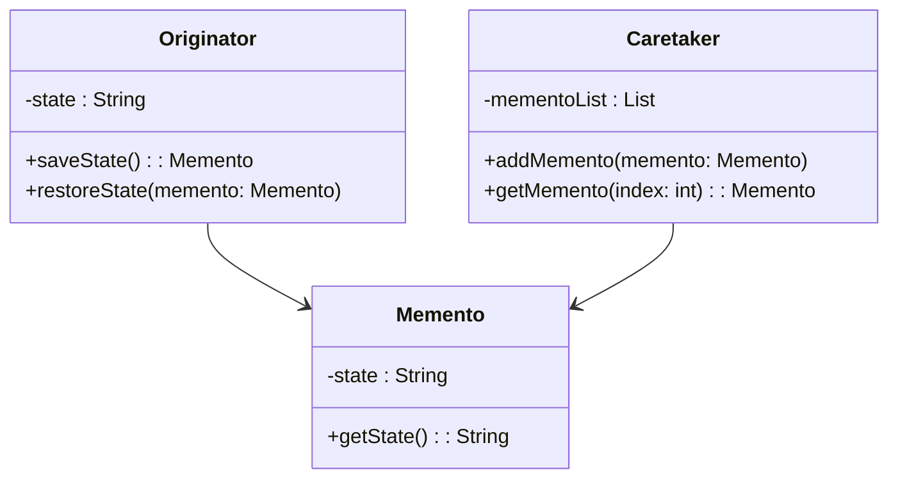

# Memento

## Intent

To capture and store an object's state so that it can be restored later without violating encapsulation.

## Motivation

Consider a text editor with an undo feature. If we store past states by exposing internal details, it breaks encapsulation. Instead, the Memento pattern allows saving and restoring object states while keeping the object's internal structure private.

## Structure

## When to Use

Use the Memento pattern when:

- You need to implement undo/rollback functionality.
  - **Example**: A text editor that allows restoring previous versions of a document.
- You want to preserve encapsulation by avoiding direct access to an object's internal state.
  - **Example**: A game that allows saving and restoring player progress.
- You need to store snapshots of an object’s state efficiently.
  - **Example**: A drawing application where users can revert changes.

## Participants

- **Originator (`Originator`)**: The object whose state needs to be saved and restored.
- **Memento (`Memento`)**: Stores a snapshot of the originator’s state.
- **Caretaker (`Caretaker`)**: Manages saved mementos without modifying them.

## Pros and Cons

| ✅ Pros                                   | ❌ Cons                                     |
|-------------------------------------------|---------------------------------------------|
| **Encapsulated state restoration**: No need to expose object internals. | **Can consume memory**: Storing too many mementos can be costly. |
| **Easy undo functionality**: Allows restoring previous states. | **Limited granularity**: May not support partial state restoration. |
| **Decouples state management**: The caretaker handles state storage without affecting the originator. | **May require deep copies**: If object states are complex, saving full copies may be inefficient. |

## How to Implement

1. **Create a `Memento` class**: Store the internal state of the `Originator` object.
2. **Modify the `Originator`**: Add methods to create and restore a `Memento`.
3. **Implement a `Caretaker`**: Manage multiple `Memento` instances.
4. **Use the memento in client code**: Save state when needed and restore it when undoing.