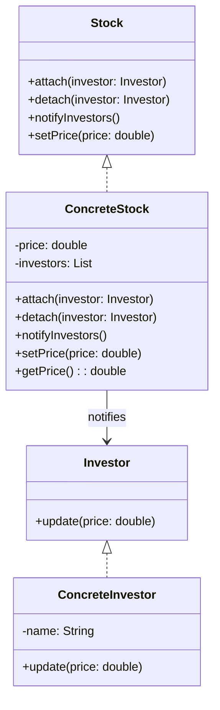

# Observer

## Intent

To define a one-to-many dependency between objects so that when one object (the subject) changes state, all its dependents (observers) are notified and updated automatically.

## Motivation

Consider a stock market application where multiple investors want to track stock prices in real time. Instead of constantly checking for updates, the investors (observers) can be notified whenever a stock price (subject) changes.

For example, without the Observer pattern, an investor might continuously query the stock price, leading to inefficient polling:

```java
public class Investor {
    private Stock stock;

    public Investor(Stock stock) {
        this.stock = stock;
    }

    public void checkStockPrice() {
        System.out.println("Current stock price: " + stock.getPrice());
    }
}
```

This approach is inefficient because it requires repeated checks. The Observer pattern allows automatic updates whenever the stock price changes.

## When to Use

Use the Observer pattern when:

- You have a **one-to-many relationship**, where multiple objects need to react to state changes in another object.
  - **Example**: A stock price tracker where multiple investors receive updates when a stock's price changes.
- You want to **decouple objects**, so the subject (stock) and observers (investors) remain independent.
  - **Example**: An investor subscribes to stock price updates without modifying the stock itself.
- You need to **automate updates** when a state changes instead of manually checking for updates.
  - **Example**: Investors automatically receive stock price notifications instead of constantly checking the stock market.

## Structure



## Participants

- **Subject (`Stock`)**: Maintains a list of observers and notifies them when the stock price changes.
- **Observer (`Investor`)**: Defines an interface for objects that should be notified of stock price changes.
- **Concrete Subject (`ConcreteStock`)**: Stores the stock price and notifies investors when the price updates.
- **Concrete Observer (`ConcreteInvestor`)**: Implements the `Observer` interface and reacts to stock price updates.

## Pros and Cons

| ✅ Pros                                           | ❌ Cons                                         |
|--------------------------------------------------|------------------------------------------------|
| **Decouples subject and observers**: The subject doesn't need to know observer details. | **Can lead to memory leaks**: If observers are not properly removed, they might stay in memory. |
| **Automatic state updates**: Observers are notified without manual polling. | **Notification overhead**: If many observers exist, frequent updates may cause performance issues. |
| **Easy to extend**: New observers can be added without modifying existing code. | **Complex debugging**: It can be hard to track which observers are notified and when. |

## How to Implement

1. **Define an `Observer` interface**: Create a method like `update()` that observers must implement.
2. **Create a `Subject` class**: Maintain a list of observers and provide methods to attach/detach them.
3. **Implement a `ConcreteSubject`**: Store the state and notify observers when the state changes.
4. **Implement `ConcreteObserver`**: React to updates from the subject.
5. **Register observers in the client code**: Attach observers to the subject and test updates.

