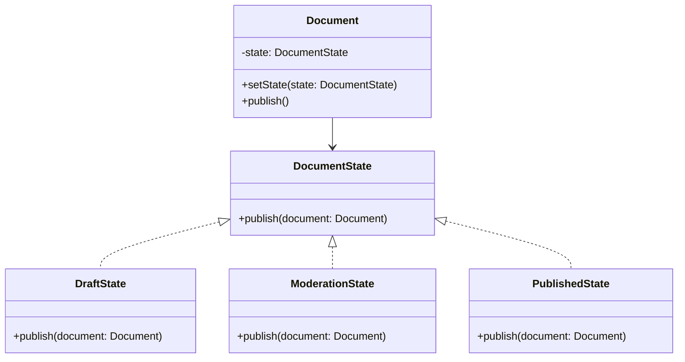

# State

## Intent

To allow an object to change its behavior when its internal state changes, making it appear as if the object has changed its class.

## Motivation

Consider a document workflow system where a document can be in different states: Draft, Moderation, and Published. Instead of using conditional logic to check the current state, we can use the State pattern to encapsulate behavior for each state and transition between them dynamically.

For example, without the State pattern, we might have:

```java
public class Document {
    private String state;

    public Document() {
        this.state = "Draft";
    }

    public void publish() {
        if (state.equals("Draft")) {
            state = "Moderation";
            System.out.println("Document sent for moderation.");
        } else if (state.equals("Moderation")) {
            state = "Published";
            System.out.println("Document published.");
        } else {
            System.out.println("Document is already published.");
        }
    }
}
```

This approach leads to complex conditional logic as more states are added. The State pattern provides a cleaner solution by encapsulating state-specific behavior in separate classes.

## When to use

Use State when:

- A document's behavior changes dynamically based on its current state.
  - **Example**: A document that transitions through different workflow stages like Draft, Moderation, and Published.
- You want to eliminate complex conditional statements checking a document's state.
  - **Example**: Instead of using `if-else` or `switch` to handle document state changes, each state has its own logic.
- You need to enforce state-specific rules without modifying the main document class.
  - **Example**: Preventing a document from being published directly from Draft without passing through Moderation.

Use State when:

- An object's behavior depends on its state and must change dynamically.
  - **Example**: A document that moves through different workflow stages (Draft, Moderation, Published).
- You want to remove complex conditional statements based on an object's state.
  - **Example**: Instead of using `if-else` or `switch` to handle document state changes, each state has its own logic.

## Structure



## Participants

- **State (`DocumentState`)**: Defines an interface for encapsulating behavior associated with an object state.
- **Concrete States (`DraftState`, `ModerationState`, `PublishedState`)**: Implement state-specific behavior for the object.
- **Context (`Document`)**: Maintains a reference to the current document state and delegates requests to it.

## Pros and Cons

| ✅ Pros                                           | ❌ Cons                                               |
|--------------------------------------------------|------------------------------------------------------|
| **Eliminates conditional complexity**: Removes long `if-else` or `switch` statements. | **More classes**: Requires creating separate state classes. |
| **Encapsulates state behavior**: Each state handles its behavior independently. | **Can increase overhead**: If states are simple, extra abstraction may be unnecessary. |
| **Improves maintainability**: Easier to add new states without modifying existing code. | **State transitions must be well-managed**: Incorrect transitions can lead to unexpected behavior. |

## How to implement

1. **Create a state interface**: Define a common interface for all possible object states.
2. **Implement concrete states**: Create classes representing different object states, implementing the state interface.
3. **Modify the context class**: Store a reference to the current state and delegate state-dependent behavior to it.
4. **Transition between states**: Change the document’s state dynamically based on actions.
