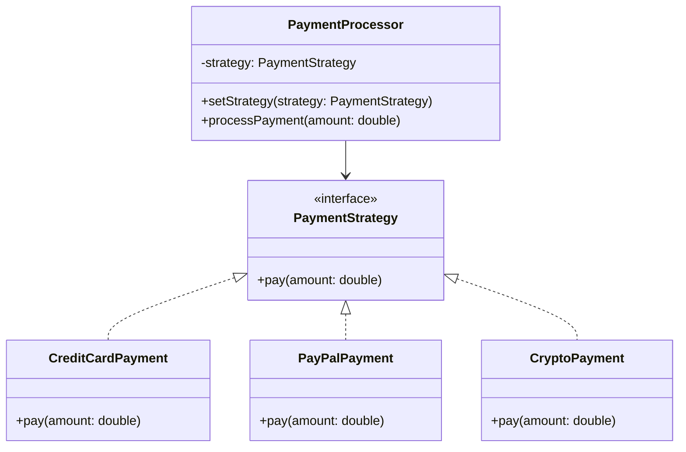

# Strategy

## Intent

To define a family of algorithms, encapsulate each one, and make them interchangeable, allowing the algorithm to vary independently from clients that use it.

## Motivation

Consider a payment system where a user can pay using different payment methods such as a credit card, PayPal, or cryptocurrency. Instead of hardcoding the payment logic inside a single class, we can use the Strategy pattern to dynamically select the appropriate payment method at runtime.

For example, without Strategy, we might have:

```java
public class PaymentProcessor {
    public void processPayment(String type, double amount) {
        if (type.equals("CREDIT_CARD")) {
            System.out.println("Processing credit card payment of $" + amount);
        } else if (type.equals("PAYPAL")) {
            System.out.println("Processing PayPal payment of $" + amount);
        } else {
            System.out.println("Unsupported payment method.");
        }
    }
}
```

This approach makes it difficult to add new payment methods without modifying the existing code. The Strategy pattern allows each payment method to be encapsulated separately.

## When to use

Use Strategy when:

- You have multiple variations of an algorithm and want to switch between them dynamically.
  - **Example**: Selecting a payment method (credit card, PayPal, cryptocurrency).
- You want to eliminate conditional statements that determine which algorithm to use.
  - **Example**: Instead of using `if-else` to choose a payment method, each method is a separate strategy.
- You need to provide different implementations of an algorithm while keeping the client code unchanged.
  - **Example**: Different pricing strategies for customers based on promotions or loyalty levels.

## Structure



## Participants

- **Strategy (`PaymentStrategy`)**: Defines a common interface for all payment strategies.
- **Concrete Strategies (`CreditCardPayment`, `PayPalPayment`, `CryptoPayment`)**: Implement the specific payment logic.
- **Context (`PaymentProcessor`)**: Maintains a reference to a strategy and delegates payment processing to it.

## Pros and Cons

| ✅ Pros                                                 | ❌ Cons                                               |
|-------------------------------------------------------|------------------------------------------------------|
| **Encapsulates algorithms**: Each strategy is independent and reusable. | **Increases number of classes**: Each strategy requires a separate class. |
| **Eliminates conditional logic**: No need for `if-else` checks to determine which strategy to use. | **Clients must be aware of strategies**: The correct strategy must be selected explicitly. |
| **Easy to add new strategies**: New strategies can be added without modifying existing code. | **May add indirection**: If not needed, the pattern can introduce unnecessary complexity. |

## How to implement

1. **Define a strategy interface**: Declare a common method for all algorithms.
2. **Implement concrete strategies**: Create separate classes for each algorithm.
3. **Modify the context class**: Store a reference to a strategy and delegate operations to it.
4. **Allow dynamic strategy selection**: Ensure the client can set the desired strategy at runtime.
