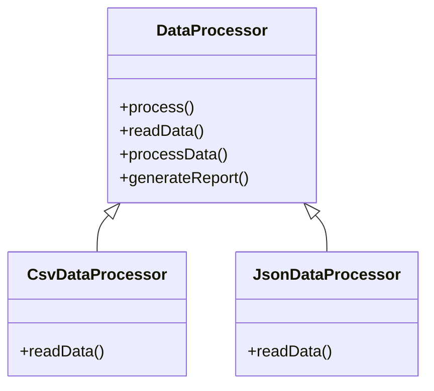

# Template Method

## Intent

To define the skeleton of an algorithm in a base class and let subclasses provide specific implementations for some steps without changing the overall structure.

## Motivation

Consider a data processing system that reads data from different sources (CSV, JSON, Database), processes it, and then generates a report. Each source has different ways of reading data, but the processing and report generation steps remain the same.

Without the Template Method pattern, we might have duplicated code in multiple classes, leading to maintenance difficulties. By defining a template method in a base class, we ensure that the overall algorithm remains consistent while allowing flexibility for specific steps.

For example, without Template Method, we might have:

```java
public class CsvDataProcessor {
    public void process() {
        readData();
        processData();
        generateReport();
    }

    private void readData() {
        System.out.println("Reading data from CSV file...");
    }

    private void processData() {
        System.out.println("Processing CSV data...");
    }

    private void generateReport() {
        System.out.println("Generating report...");
    }
}
```

The issue is that if we want to process data from JSON, databases, or other sources, we need to duplicate logic for `processData()` and `generateReport()`, even though they are the same. The Template Method pattern allows us to extract the common algorithm into a superclass while letting subclasses define specific steps.

## When to use

Use **Template Method** when:

- You want to enforce a common structure for an algorithm while allowing variations in some steps.
  - **Example**: A data processing framework where different sources (CSV, JSON, Database) must follow the same pipeline.
- You want to avoid code duplication by moving reusable code to a superclass.
  - **Example**: A document rendering system where HTML, PDF, and Markdown formats share common layout logic.
- You want to control the execution order of steps while allowing subclasses to customize only specific parts.
  - **Example**: A game engine where different AI behaviors inherit from a base AI class.

## Structure



## Participants

- **Abstract Class (`DataProcessor`)**: Defines the **template method** and implements the common steps. Subclasses override only the necessary steps.
- **Concrete Classes (`CsvDataProcessor`, `JsonDataProcessor`)**: Implement the steps specific to their data source.
- **Client**: Calls the template method on a concrete class, ensuring the algorithm executes in the predefined order.

## Pros and Cons

| ✅ Pros                                                 | ❌ Cons                                            |
|--------------------------------------------------------|----------------------------------------------------|
| **Encourages code reuse**: Shared logic stays in one place. | **Less flexibility**: The structure of the algorithm is fixed. |
| **Enforces a standard execution flow**.               | **Can lead to complexity**: Too many hooks may make the base class harder to understand. |
| **Reduces duplicate code**: Subclasses implement only specific variations. | **Subclassing requirement**: New behavior requires creating a new subclass. |

## How to implement

1. **Identify the common structure** of an algorithm that should remain unchanged across implementations.
2. **Create an abstract class** defining the **template method**, marking some steps as abstract (to be implemented by subclasses).
3. **Implement concrete subclasses** that override only the necessary steps.
4. **Use the template method** in the client code, ensuring the execution order is maintained.