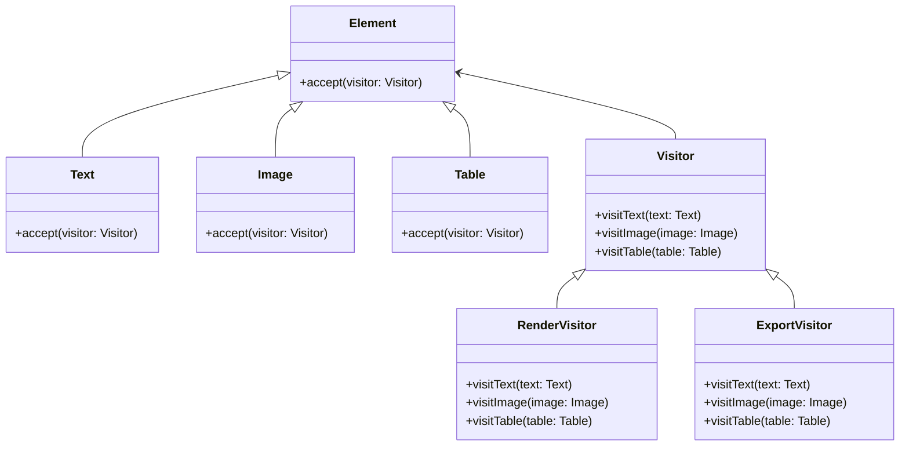

# Visitor

## Intent

To define a new operation on a set of objects without modifying their classes, by separating the algorithm into a visitor class.

## Motivation

Consider a document processing application where different elements (Text, Image, Table) need to support various operations like rendering, exporting, or printing. Instead of adding new methods to each element class whenever a new operation is required, the Visitor pattern allows defining these operations in separate visitor classes.

For example, without the Visitor pattern:

```java
public class Text {
    public void render() { System.out.println("Rendering text"); }
    public void export() { System.out.println("Exporting text"); }
}

public class Image {
    public void render() { System.out.println("Rendering image"); }
    public void export() { System.out.println("Exporting image"); }
}
```

## When to use

Use Visitor when:

- You need to add operations to a class hierarchy without modifying the existing classes.
- You have a set of related objects with different types and need to perform operations on them without breaking encapsulation.
- You want to keep operations separate from the data structures they operate on.

## Structure



## Participants

- **Element** (`Text`, `Image`, `Table`): Objects that accept visitors and allow operations to be performed on them.
- **Visitor** (`Visitor`): Defines operations for each type of element.
- **Concrete Visitors** (`RenderVisitor`, `ExportVisitor`): Implement specific operations for each element type.
- **Client**: Passes visitors to elements to execute operations dynamically.

## Pros and Cons

| ✅ Pros                                              | ❌ Cons                                                 |
|-----------------------------------------------------|--------------------------------------------------------|
| **New operations can be added easily**: Without modifying existing classes. | **Adding new element types requires modifying visitors**. |
| **Separates concerns**: Keeps operations separate from data structures. | **Breaks encapsulation**: Visitors may need access to private fields. |
| **Improves maintainability**: Easier to extend behavior. | **Complexity increases**: More classes and indirection. |

## How to implement

1. **Define an interface (`Element`)** with an `accept(Visitor visitor)` method.
2. **Create concrete elements (`Text`, `Image`, `Table`)** that implement `accept()`, passing `this` to the visitor.
3. **Define a `Visitor` interface** with methods for visiting each element type.
4. **Implement concrete visitors (`RenderVisitor`, `ExportVisitor`)** that define the operations.
5. **Use the visitor** by passing it to elements, allowing operations to execute dynamically.