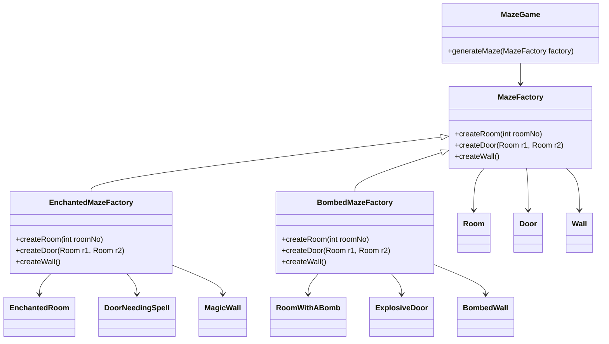

# Abstract Factory

## Intent
To provide an interface to create a family of related objects without specifying their concrete classes.

## Motivation
Consider the maze game example, where different types of mazes could exist (e.g., regular maze, enchanted maze with magic doors or a bombed maze with explosive walls).

Without abtract factory, the game could have to instantiate different maze components directly:
```java
Room room1 = new EnchantedRoom(1);
Door door = new ExplosiveDoor();
Wall wall = new MagicWall();
```
This hard-codes dependencies between the game logic and the concrete maze components, making it difficult to:
* Extend the game with new types of mazes.
Modify maze components without changing game logic.
* Test different maze configurations independently.

## When to use
Use Abstract Factory when:

* System needs to create families of related objects without specifying their concrete classes.
  * **Example:** Different types of UI elements (Windows vs. macOS buttons and menus).
* System should be independent of how its products are created, composed, and represented.
  * **Example:** A maze game that can generate either an enchanted maze or a bombed maze without modifying the core game logic.
* A family of product objects is designed to be used together and you need to ensure this restriction.
  * **Example:** An enchanted maze must have only enchanted objects.
* You want to provide a product classes library and want to reveal only its interfaces, not the implementations.
  * **Example:** Maze game framework that provides only interfaces like MazeFactory, Wall, Room and Door, without exposing concrete classes. This allows different maze variations to be created by extending framework without modifying the core logic.

## Structure



## Participants
* **AbstractFactory** (MazeFactory): Defines an interface for operation that creates abstract product objects.
* **ConcreteFactory** (EnchantedMazeFactory, BombedMazeFactory): Implements the operations that create concrete product objects.
* **AbstractProduct** (Room, Wall and Door): Declares the interface for a product object.
* **ConcreteProduct** (EnchantedRoom, RoomWithABomb, etc): Defines a product object to be created by the corresponding concrete factory. It implements AbstractProduct.
* **Client** (MazeGame): Uses only interfaces declared by Abstract Factory classes and Abstract Product.

## Pros and Cons
| ** ✅ Pros**                                      | **❌ Cons**                                      |
|------------------------------------------------|-----------------------------------------------|
| **Decouples client code from concrete classes**: The client interacts only with abstract interfaces, not specific classes. | **Complexity**: Adding new products or variations increases the complexity of the system, especially as the number of product types grows. |
| **Easier to add new variants**: New product families can be added without changing existing client code. | **Increased number of classes**: You need to create many classes to implement the pattern, which can increase the size of the codebase. |
| **Improves flexibility and extensibility**: The pattern allows you to easily swap out product families or components. | |
| **Provides a common interface for related products**: Ensures that products are created in a consistent manner. | |

## How to implement
  1. **Idenfity Abstract Product Families:** Determine the different types of related products you need. These products must be designed to work together, and you'll be creating variations of them. For example, if you are creating a maze game, these could be different types of rooms, doors, and walls.
  2. **Define Abstract Product Interfaces:** Create interfaces (or abstract classes) for each type of product in the family. For example, you'll have an interface for Room, Door, and Wall. These will define the common operations that all product variations must implement.
  3. **Create Concrete Product Classes:** Implement concrete product classes that extend or implement the abstract product interfaces. Each concrete product represents a specific variation of the product (e.g., EnchantedRoom, MagicWall).
  4. **Define the Abstract Factory Interface:** Define an interface for the abstract factory. This factory will have methods like createRoom(), createDoor(), and createWall(), which will return abstract product types.
  5. **Implement Concrete Factories:** For each variation of the product family (e.g., EnchantedMaze, BombedMaze), implement a concrete factory class that implements the abstract factory interface. Each concrete factory will instantiate the appropriate concrete products (e.g., EnchantedRoom, ExplosiveDoor).
  6. **Intantiate Factories Somewhere:** Instantiate one of the factory classes and pass it to all classes that construct products (e.g. MazeGame).