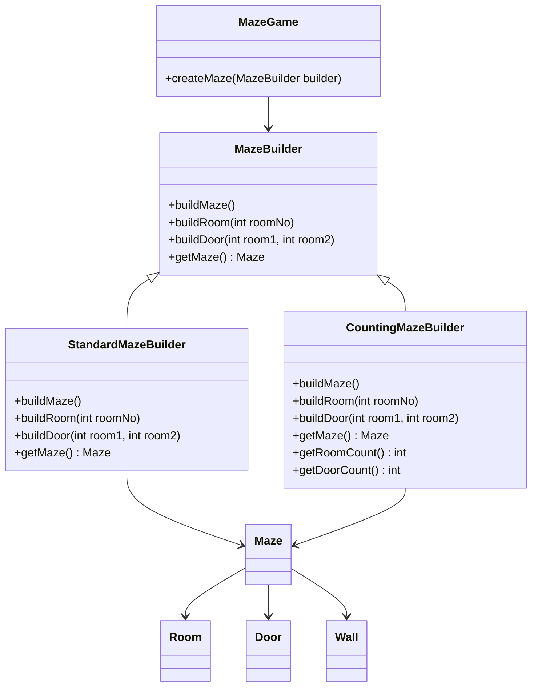

# Builder

## Intent
To separate a complex object construction from their representation, in a way that the same construction process can create different representations.

## Motivation  
Consider the maze game example, where different configurations of mazes could exist (e.g., a small maze, a complex maze with many rooms, or a maze with predefined structures).  

Without the Builder pattern, the game logic would need to manually construct and assemble each maze component:  

```java
Maze maze = new Maze();
Room room1 = new Room(1);
Room room2 = new Room(2);
Door door = new Door(room1, room2);

room1.setSide(Direction.EAST, door);
room2.setSide(Direction.WEST, door);

maze.addRoom(room1);
maze.addRoom(room2);
```

This approach tightly couples the game logic with the construction process, making it difficult to:
* Change the way mazes are built without modifying the game logic.
* Support different construction strategies (e.g., counting rooms instead of actually building them).
* Construct complex mazes in a step-by-step manner while ensuring consistency.

## When to use  
Use Builder when:  

* The construction process of a complex object should be separated from its representation.  
  * **Example:** Building a maze step by step, allowing different configurations without changing the game logic.  
* The same construction process should create different representations of an object.  
  * **Example:** A builder that can either construct a full maze or just count the number of rooms without actually creating them.  
* The system needs greater control over the object creation process, ensuring consistency and correctness.  
  * **Example:** Ensuring that all rooms, doors, and walls in a maze are set up properly before being used.  
* You want to create an object incrementally through a series of steps rather than a large constructor with multiple parameters.  
  * **Example:** Constructing a complex maze with multiple rooms, doors, and walls without requiring a massive constructor call.  

## Structure  



## Participants  
* **Builder** (MazeBuilder): Defines an interface for creating the different parts of a complex object step by step.  
* **ConcreteBuilder** (StandardMazeBuilder, CountingMazeBuilder): Implements the construction steps defined in Builder to create specific representations of the product.  
* **Product** (Maze): Represents the complex object being built.  
* **Director** (MazeGame): Constructs a product using the Builder interface, ensuring that the building steps are executed in the correct order.  
* **Client**: Calls the Director to build an object, optionally retrieving the final product from the Builder.  

## Pros and Cons  
| ** ✅ Pros**                                      | **❌ Cons**                                      |  
|------------------------------------------------|-----------------------------------------------|  
| **Step-by-step construction**: Allows incremental object creation, making it easier to control complex setups. | **Increased complexity**: Introduces additional classes and interfaces, making the codebase more complex. |  
| **Decouples construction from representation**: The same building process can create different representations of the product. | **Not always necessary**: If the object isn’t complex, using a builder may be overkill compared to simple constructors or factory methods. |  
| **Improves code readability**: Eliminates large constructors with multiple parameters, making object creation clearer. | **Requires a Director in some cases**: The Director adds another layer of abstraction that may not always be needed. |  
| **Allows different representations of the same object**: Useful when multiple variations of an object need to be created. | |  

## How to implement  
1. **Identify Complex Object Construction Needs:** Determine which objects require a step-by-step construction process, such as a maze with different room configurations.  
2. **Define the Product Class:** Create a class representing the complex object (e.g., `Maze`) that will be incrementally built.  
3. **Create a Builder Interface:** Define an interface (`MazeBuilder`) with methods to construct the different parts of the product (`buildRoom()`, `buildDoor()`, etc.).  
4. **Implement Concrete Builders:** Create concrete implementations of the builder interface (`StandardMazeBuilder`, `CountingMazeBuilder`), defining how each part of the product is built.  
5. **Create a Director Class:** Implement a director (`MazeGame`) that orchestrates the construction process using the builder methods. This ensures a consistent order of object creation.  
6. **Use the Builder in the Client Code:** The client (`main()`) instantiates a builder and passes it to the director, which calls builder methods to create the final object.  
