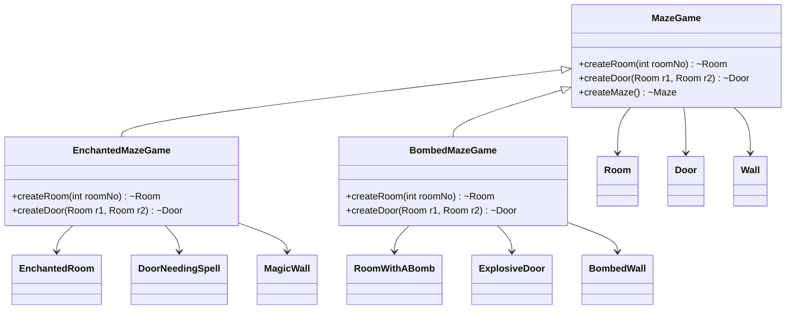

# Factory Method

## Intent
To define an interface to create an object, but let the subclasses which class to instantiate. Factory Method allows you to defer instantiation to subclasses.

## Motivation  
Consider the maze game example, where different types of mazes could exist (e.g., regular maze, enchanted maze with magic doors, or a bombed maze with explosive walls).

Without Factory Method, the game would need to instantiate different maze components directly: 

```java
Room room1 = new EnchantedRoom(1);
Door door = new ExplosiveDoor();
Wall wall = new MagicWall();
```

This hard-codes dependencies between the game logic and the concrete maze components, making it difficult to:
* Extend the game with new types of mazes.
* Modify maze components without changing game logic.
* Test different maze configurations independently.

The Factory Method pattern allows subclasses to decide which concrete classes to instantiate, enabling better flexibility and separation of concerns.

## When to use  
Use Factory Method when:  

* A class needs to delegate the instantiation of objects to its subclasses.  
  * **Example:** `MazeGame` should allow subclasses to define which types of maze components (rooms, doors, walls) to create.
* The exact type of object to be created is determined by subclasses rather than a base class.
  * **Example:** `EnchantedMazeGame` can create enchanted rooms, while `BombedMazeGame` can create bombed rooms.
* You want to localize knowledge of which specific classes are instantiated.
  * **Example:**  Instead of calling `new` in the main game logic, Factory Method centralizes the object creation process in a subclass. 

## Structure  



## Participants  
* **Creator** (MazeGame): Declares the Factory Methods that return new product objects.
* **ConcreteCreator** (EnchantedMazeGame, BombedMazeGame): Implements the Factory Methods to create specific product instances.
* **Product** (Room, Door, Wall): Declares the interface of the objects the Factory Method creates.
* **ConcreteProduct** (EnchantedRoom, RoomWithABomb, etc.): Implements the Product interface.

## Pros and Cons  
| **✅ Pros**                                      | **❌ Cons**                                      |  
|------------------------------------------------|-----------------------------------------------|  
| **Encapsulates object creation:** Concrete classes are instantiated in a single place. | **Class proliferation:** More subclasses may be required for different product variations. |  
| **Supports open/closed principle:** New product variations can be introduced without modifying existing code. | **Increased complexity:** Factory methods introduce additional abstraction layers. |  
| **Promotes code reuse:** Common logic remains in the base class while allowing customization in subclasses. |  |  
| **Decouples client code from concrete classes:** The client interacts only with abstract interfaces, not specific implementations. | |  

## How to implement  
1. **Identify the object creation that needs to be encapsulated:** Look for places in the code where objects are instantiated directly and vary across different use cases.

2. **Define a common interface for the objects:** Ensure all objects to be created share a common interface (or abstract class).

3. **Create the Factory Method in a base class:** Define a method in the base class that returns an instance of the product.

4. **Implement Concrete Creators:** Subclasses override the Factory Method to create specific product instances.

5. **Use the Factory Method in the client code:** Instead of instantiating objects directly, the client calls the Factory Method.
