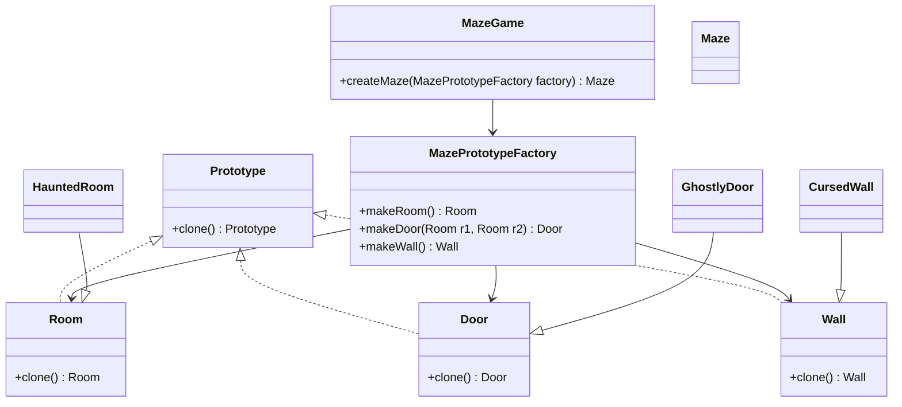

# Prototype

## Intent
To allow creating new objects by copying an existing object (a prototype) instead of initializing a new one from scratch.

## Motivation  
Consider the maze game example, where different types of mazes exist, and now we introduce a **Haunted Maze** with eerie rooms, ghostly doors, and cursed walls. Instead of manually instantiating and configuring these elements repeatedly, we can use the Prototype pattern to clone existing prototypes and generate new variations dynamically.

Creating new instances manually could lead to inefficiencies and unnecessary coupling with concrete classes. Additionally, if certain attributes (e.g., `isCursed` in `CursedWall`) are private and not accessible, direct instantiation may not be feasible.

The Prototype pattern allows cloning existing objects instead of creating new ones from scratch, enabling:
* Efficient creation of objects with predefined configurations.
* Decoupling object instantiation from its concrete class.
* Flexible runtime modification of prototypes to generate variations dynamically.

## When to use  
Use Prototype when:  

* Object creation is expensive or complex.  
  * **Example:** A haunted maze where configuring cursed walls and ghostly doors involves intricate configurations, making cloning more efficient.
* You need to create new objects by copying existing ones.
  * **Example:** Instead of manually instantiating and configuring different types of haunted rooms, you duplicate a prototype and modify it if needed.
* The system should be independent of how its objects are created.
  * **Example:** A maze game where the game logic doesn't need to know the concrete classes of the maze components, as they are cloned dynamically.
* You want to allow dynamic configuration of objects at runtime.
  * **Example:** A game where haunted rooms can be modified and generated without modifying the base code.

## Structure  

## Participants  
* **Prototype** (Room, Door, Wall): Defines an interface with a clone() method for creating new objects.
* **ConcretePrototype** (HauntedRoom, GhostlyDoor, CursedWall): Implements the `clone()` method to return a copy of itself.
* **Client** (MazePrototypeFactory): Keeps a set of prototype instances and creates new objects by cloning them.
* **MazeGame**: Uses MazePrototypeFactory to create maze components without depending on concrete classes.

## Pros and Cons  

| **✅ Pros** | **❌ Cons** |  
|------------|------------|  
| **Reduces subclassing**: Instead of creating multiple subclasses, new objects can be created by cloning existing ones. | **Cloning complexity**: Some objects might be difficult to clone, especially those with complex internal structures or circular references. |  
| **Improves performance**: Cloning is often faster than creating new instances from scratch, especially for complex objects. | **Deep vs. shallow copy issues**: Care must be taken to ensure that the cloned object is fully independent of the original. |  
| **Encapsulates object creation**: The prototype itself handles object creation, making it easier to extend and modify without altering client code. | **Managing prototype registry**: Keeping track of prototypes can add complexity to the system. |  
| **Dynamic object creation**: New object types can be introduced at runtime without modifying existing code. | |

## How to implement  

1. **Identify objects that should be created via cloning:** Look for objects that are expensive to create or need to be dynamically instantiated at runtime.  
2. **Define a Prototype interface:** Create an interface or abstract class with a `clone()` method to be implemented by concrete prototypes.  
3. **Implement Concrete Prototypes:** Each concrete class implements the `clone()` method to return a copy of itself. Decide whether a shallow or deep copy is needed.  
4. **Use a Prototype Registry (Optional):** If multiple prototypes are needed, store them in a registry so they can be cloned on demand instead of being instantiated manually.  
5. **Replace direct instantiation with cloning:** Modify the client code to create new objects by cloning existing prototypes instead of using `new`.  
