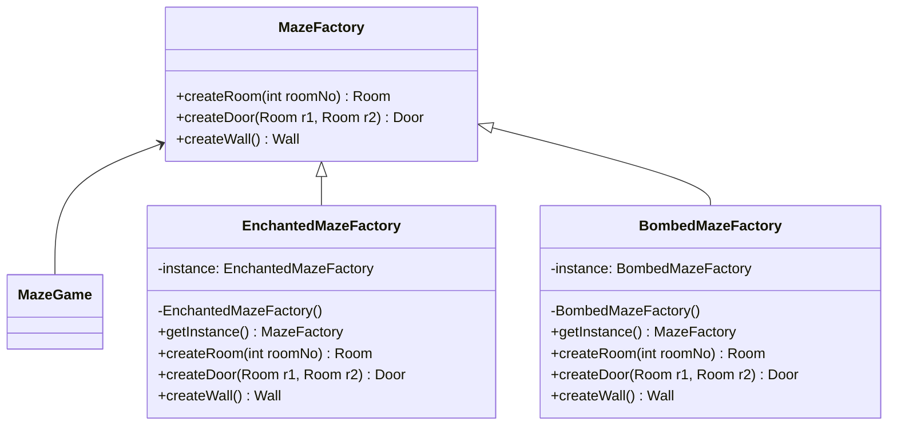

# Singleton

## Intent
To ensure that only a single instance of a class exist and it's available globally throughout the system.

## Motivation
Consider the maze game example, where we need to have a factory object `MazeFactory` to create maze objects (e.g. Wall, Room and Door).

In order to use `MazeFactory`, we might have to instantiate it whenever we need. However this approach comes with some tradeoffs:
* Waste of memory, since many instances will need to be stored.
* A variable might be eagerly instantiated, but never used, again wasting memory.
* Global variables might be used. While they are good for many cases, they can be easily overwritten

## When to use
Use Singleton when:
* It's required to have a single instance of a class and this instance has to be globally accessible.
  * **Example:** A single `MazeFactory` must exist for the whole maze game.
* This single instance must be extensible through subclasses, allowing the client code to use a single extended intance without changing its code.
  * **Example:** In maze game, user could change the type of maze to use (e.g. enchanted, bombed), so a single concrete factory should be instantiated (e.g. `EnchantedMazeFactory`, `BombedMazeFactory`).

## Structure

## Participants
* **Singleton** (EnchantedMazeFactory, BombedMazeFactory): Manages a single instance of itself and makes it accessible through `getInstance()` method.
* **Client** (MazeGame): Uses the Singleton class to create and access the global instance.

## Pros and Cons
| **✅ Pros**                                      | **❌ Cons**                                      |
|------------------------------------------------|-----------------------------------------------|
| **Controlled access to a single instance**: encapsulates the single instance, thus it has full control on how client code accesses it. | **Multiple responsibility**: Singleton solves two problems at same time (instance management and its primary functionality). |
| **Less variables**: Only one instance is required and it can be reused throughout the code.  | **Bad for multithreading**: Requires careful design to avoid the same instance being created multiple times. |
| **Eager initialization**: The singleton variable is created only when it's required. | **Difficult to test**: Due to private constructor on singleton classes, test frameworks may not be able to mock instances. |

## How to implement
1. **Identify A Single Instance Class:** Determine which class needs to have a single instance accessible from other parts of the code.
2. **Ensure The Class Cannot Be Instantiated:** All constructors of this class must be marked as private, so they are accessible only from inside the class.
3. **Provide A Method to Access The Instance:** Define a private field which will be the instance of this class and a method `getInstance()` that will check if instance is defined (otherwise it will create a new one) and return it.