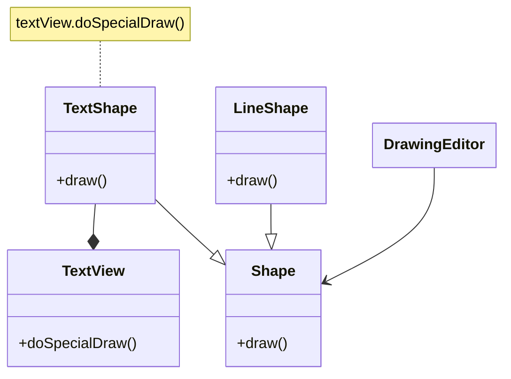
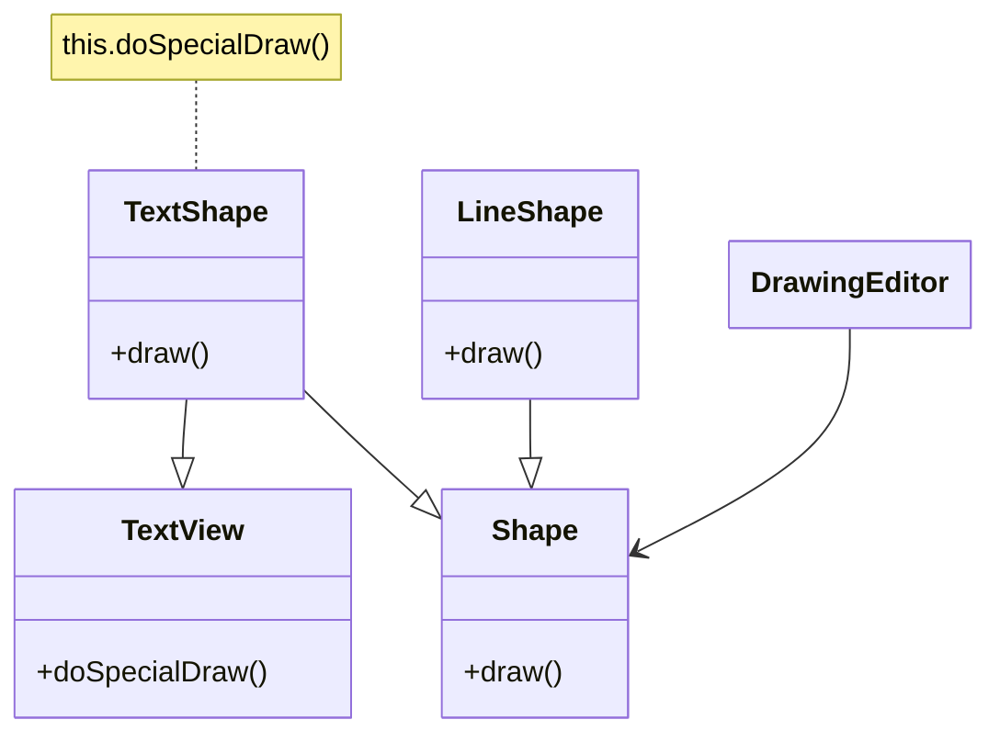

# Adapter

## Intent
To convert a class interface into another interface, that is expected by the clients. Adapter allows incompatible classes to work together.

## Motivation
Consider the example of a Drawing Editor, where users can draw and manipulate graphic elements (e.g. lines, polygons, text). Every element is a `Shape`. A `LineShape` is easy to implement because it's easy to draw a line, however a `TextShape` might be tricky. We can use a 3rd party library for that, which provides a class `TextView` that can draw text in a simpler way.

The issue with this approach is that `TextView` wasn't projected to work with `Shape`, they are not **interchangeable**. We can't even change the `TextView` code to extend `Shape` because we don't have access to the 3rd party library code.

## When to Use
Use Adapter when:
* You want to use an existing class, but your interface doesn't match the target interface.
  * **Example**: We want to use `TextView` but it doesn't match the `Shape` interface.
* You want to create a reusable class that works with non-related or non-expected classes, in other words, classes not **interchangeable**.
  * **Example**: We want to create a `TextShape` but it needs to work with `TextView` which is not known by the project code.
* You need to use several existing subclasses, however, it's not feasible adapt these interfaces by creating subclasses for each one. A single object adapter can adapt the interface and its parent class.

## Structure
There are 2 ways to define Adapter:

### Object Adapter

### Class Adapter

## Participants
* **Target** (Shape): Defines a specific interface of a domain the Client uses.
* **Client** (DrawingEditor): Works with concrete classes of Target.
* **Adaptee** (TextView): Existing class to be adapted.
* **Adapter** (TextShape): Adapts the Adaptee interface to the Target interface.

## Pros and Cons
| **✅ Pros**                                      | **❌ Cons**                                      |
|------------------------------------------------|-----------------------------------------------|
| **Enables compatibility**: Allows incompatible interfaces to work together by acting as a bridge. | **Increased complexity**: Adds extra layers of abstraction, which can make the system more complex. |
| **Supports legacy code integration**: Helps integrate old components with new ones without modifying existing code. | **Performance overhead**: Depending on the implementation, adapting one interface to another can introduce a slight performance cost. |
| **Promotes code reusability**: You can reuse existing classes without modifying their code. | **May introduce additional maintenance**: If the adapter is poorly designed, it may require frequent updates when either interface changes. |
| **Improves separation of concerns**: Keeps client code independent of specific implementations. | |

## How to implement

1. **Identify classes with incompatible interfaces**: It must have at least two classes with incompatible interfaces (e.g. `Shape` and `TextView`).
2. **Declare an interface known by client**: The client code must know which operations it can invoke, by looking into an interface (e.g. `Shape`).
3. **Implement adapter**: Create an adapter class (e.g. `TextShape`) that implements the common interface (e.g. `Shape`) and has an instance of adaptee (e.g. `TextView`) or extends it. The interface operations should be implemented by using the adaptee instance to actually do the job.