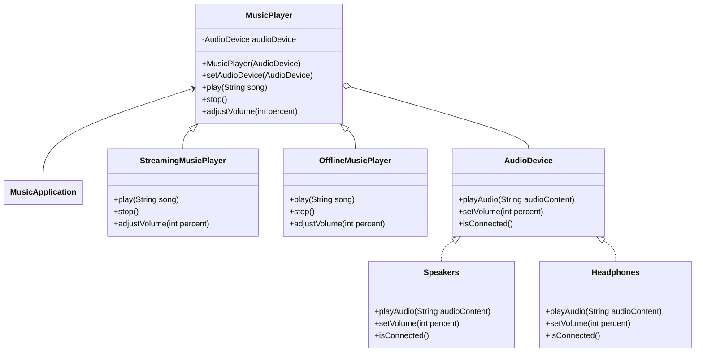

# Bridge

## Intent
To decouple an abstraction from its implementation so that the two can vary independently.

## Motivation
Consider a music player system that needs to support different types of audio output devices. Without the Bridge pattern, we might have to create separate music player classes for each device:

```java
class SpeakerMusicPlayer { }
class HeadphoneMusicPlayer { }
```

This approach leads to an explosion of classes because you need to add new player types and devices. The Bridge pattern avoids this issue by:
* Separating the player abstraction from device implementations, allowing both to vary independently
* Making it easy to add new player types or devices without modifying existing code

## When to use

Use Bridge when:

* You want to avoid a permanent binding between an abstraction and its implementation.
    * **Example**: A music player that works with different audio devices (speakers, headphones, car audio).

* Both the abstractions and their implementations should be extensible through subclassing.
  * **Example**: Adding new types of players (streaming, offline) and new devices (Bluetooth, wired) independently.

* Changes in the implementation should not impact the client code.
  * **Example**: Switching from speakers to headphones shouldn't require changing how the player is used.

* You want to hide implementation details completely from clients.
  * **Example**: Client code doesn't need to know how a specific audio device works.


* You have a proliferation of classes resulting from a coupled interface and numerous implementations.
  * **Example**: Without Bridge, every combination of player type and device would need its own class.

## Structure


## Participants
* **Abstraction** (MusicPlayer): Defines the abstraction's interface and maintains a reference to an object of type Implementor.

* **RefinedAbstraction** (StreamingMusicPlayer, OfflineMusicPlayer): Extends the interface defined by Abstraction.

* **Implementor** (AudioDevice): Defines the interface for implementation classes. This doesn't have to correspond exactly to Abstraction's interface.

* **ConcreteImplementor** (Speakers, Headphones): Implements the Implementor interface and defines its concrete implementation.

* **Client** (MusicApplication): Uses the Abstraction interface to interact with the system.

## Pros and Cons
| **✅ Pros**                                      | **❌ Cons**                                      |
|------------------------------------------------|-----------------------------------------------|
| **Decouples interface from implementation**: Changes to the implementation don't affect client code. | **Increased complexity**: It might make the code harder to understand. |
| **Improves extensibility**: You can extend both hierarchies independently. | **More complex design**: Requires advanced planning and complex design compared to a simpler solution. |
| **Hides implementation details from clients**: Clients only see the abstraction, not implementation. | |
| **Allows implementation switching at runtime**: The implementation object can be replaced during program execution. | |
| **Reduces class explosion**: Avoids a separate class for each combination of abstraction and implementation. | |

## How to implement

1. **Identify dimensions**: Determine if you have two independent dimensions of variation (abstraction and implementation).

2. **Define implementor interface**: Create an interface that the concrete implementations will implement. Focus on the operations that the abstraction needs.

3. **Create Concrete Implementors**: Implement the Implementor interface for each platform or variation.

4. **Define the Abstraction**: Create an abstract class that contains a reference to the Implementor and defines the operations.

5. **Create Refined Abstractions**: Extend the Abstraction class to provide variant high-level operations.

6. **Connect abstraction with implementation**: In the Abstraction constructor, allow the client to connect a specific implementor.