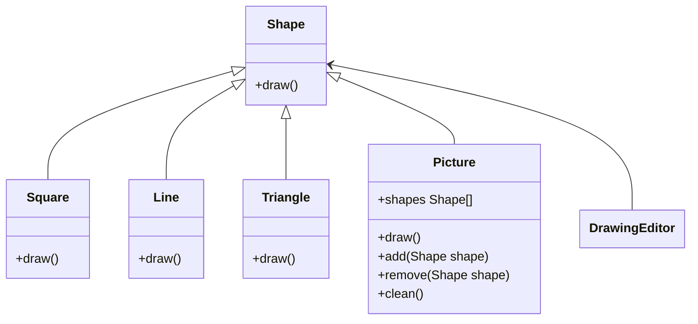

# Composite

## Intent
To compose objects into tree structures and work with them as if they were individual objects.

## Motivation
Consider a drawing editor example, where user may draw `Shape`s (e.g. lines, squares, triangles). In this application, a `Picture` is a container that holds multiple shape objects. Drawing editors often allow users to create pictures inside pictures, in a recursive way. Notice that now a drawing is in format of a tree structure, where a `Picture` is a subtree and simple shapes are leaves (e.g. line, square, triangle). The composite pattern becomes in handy when there is a need of an application to be represented as a tree, because it helps to represent both trees and leaves as individual objects of the same type.

## When to use
Use Composite when:
* You need to implement a tree-like object structure
  * **Example**: `Picture` is a tree and `Square`, `Line`, `Rectangle` are leaves of a tree.
* You want the client to treat both simple and complex elements uniformly
  * **Example**: `Picture` and simple shape objects must be treated as `Shape` objects by the drawing editor.

## Structure

## Participants
* **Component** (Shape): Defines a common interface to both simple and complex elements in the tree.

* **Leaf** (Line, Square, Triangle): It is a basic element, doesn't have children elements.

* **Composite** (Picture): Defines the behavior of elements with children elements.

* **Client** (DrawingEditor): Manipulates objects using `Component` interface.

## Pros and Cons
| **✅ Pros**                                      | **❌ Cons**                                      |
|------------------------------------------------|-----------------------------------------------|
| **Simplifies client code**: Treats individual objects and compositions uniformly. | **Can make the system overly general**: Might introduce unnecessary complexity for simple cases. |
| **Encourages a hierarchical structure**: Useful for tree-like structures such as UI components or file systems. | **Difficult to restrict components**: Clients might mistakenly use inappropriate operations on certain elements. |
| **Supports recursive structures**: Easily represents nested or recursive relationships. | **Increases memory usage**: Storing parent-child relationships can add overhead. |
| **Improves maintainability**: Reduces duplicated code when handling complex object structures. | |

## How to implement

1. **Identify the hierarchical structure**: Determine if your objects can be represented as a tree-like structure where individual objects and groups need to be treated uniformly.

2. **Create the Component interface**: Define a common interface for both leaf and composite elements. This should include operations that both will support.

3. **Implement Leaf objects**: Create concrete classes representing individual elements that do not contain children.

4. **Implement Composite objects**: Create a class that maintains a collection of child components and implements operations like adding, removing, and iterating over children.

5. **Ensure uniform client interaction**: Clients should be able to treat both individual objects and compositions in the same way through the Component interface.

6. **Use where appropriate**: Apply the pattern when dealing with complex hierarchical structures that need uniform treatment.
