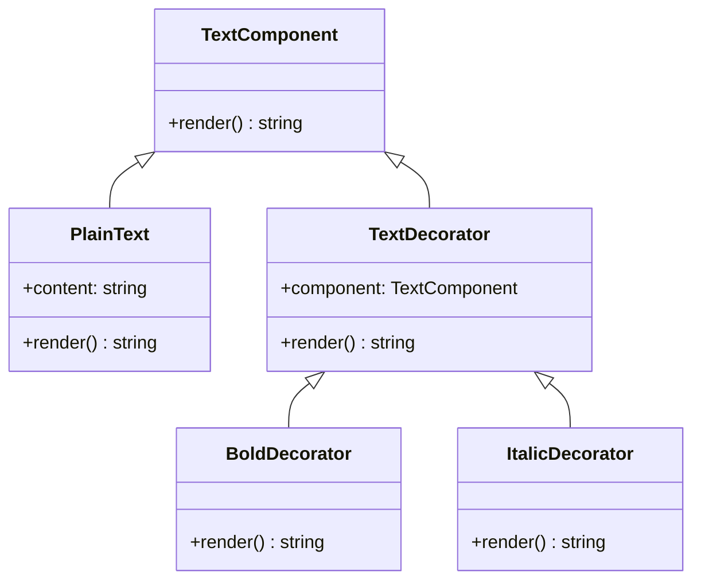

# Decorator

## Intent
To dynamically attach additional responsibilities to an object without modifying its structure.

## Motivation
Consider a text editor that supports different formatting options such as **bold**, *italic*, and `code`. Instead of modifying the core `Text` class every time a new formatting option is introduced, we can use the **Decorator** pattern. Each formatting option is implemented as a separate class that wraps an existing `Text` object, adding new behavior dynamically. This approach allows for flexible combinations of formatting styles without modifying the base class.

## When to use
Use Decorator when:
* You need to **dynamically add or remove behaviors** from objects at runtime.
  * **Example**: A `Text` object can be wrapped with `BoldDecorator`, `ItalicDecorator`, or both, without modifying its structure.
* You want to **extend functionalities without subclassing**.
  * **Example**: Instead of creating multiple subclasses for different text formatting styles, decorators can be composed flexibly.
* You need to follow **Open/Closed Principle**, ensuring that new behaviors can be added without modifying existing code.

## Structure

## Participants
* **Component** (`TextComponent`): Defines the common interface for objects that can have additional responsibilities dynamically.
* **Concrete Component** (`PlainText`): The base implementation of `TextComponent` that holds the core functionality.
* **Decorator** (`TextDecorator`): Holds a reference to a `TextComponent` object and implements the same interface.
* **Concrete Decorators** (`BoldDecorator`, `ItalicDecorator`): Extend the behavior of `TextComponent` by adding new functionalities.

## Pros and Cons
| **✅ Pros**                                      | **❌ Cons**                                      |
|------------------------------------------------|-----------------------------------------------|
| **Flexible extension of behavior**: New functionalities can be added without modifying existing code. | **Increases complexity**: Can lead to many small classes wrapping each other. |
| **Supports dynamic composition**: Decorators can be combined in various ways. | **Harder to debug**: Wrapping multiple decorators can make it difficult to track behavior. |
| **Follows Open/Closed Principle**: Allows modification without altering existing code. | **Not always efficient**: Too many decorators may introduce performance overhead. |

## How to implement

1. **Create a Component interface**: Define a common interface for both the core object and decorators.

2. **Implement the Concrete Component**: Create a basic implementation of the component.

3. **Create an Abstract Decorator**: Implement a class that wraps a `Component` and forwards method calls.

4. **Implement Concrete Decorators**: Extend the abstract decorator to add new behavior.

5. **Allow dynamic decoration**: Ensure that decorators can be layered over each other at runtime.

6. **Use where appropriate**: Apply when behavior needs to be dynamically added without modifying existing classes.
