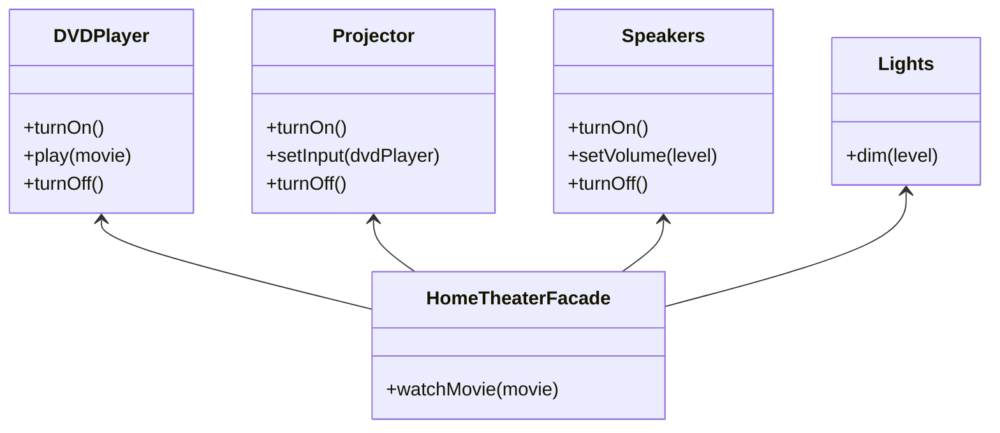

# Facade

## Intent
To provide a simplified interface to a library or a subsystem, containing only the operations that the clients really care about.

## Motivation
Consider a home theater system, which controls multiple devices in order to set up an environment to watch a movie. The application needs to interact with a DVD player, speakers volume, dim the lights, turn on/off a projector and so on. We could use a handy library that provides all classes and operations, so the client would need to do that:

```java
public class HomeTheaterClient {
  
  public static void main(String[] args) {
    DVDPlayer dvdPlayer = new DVDPlayer();
    Speakers speakers = new Speakers();
    Light light = new Light();
    Projector projector = new Projector();
    String movie = "Shrek";

    light.dim(30);
    projector.turnOn();
    dvdPlayer.play(movie)
    speaker.setVolume(40);
    // ... And so on ...
  }
}
```

A bunch of operations are being done by client. However a client is interested only in watching a movie, it doesn't actually care about how to set up the home theater itself. Also, by following that approach, we are tightly coupling our client code to the library's code.

## When to use
Use Facade when:
* You need to provide a simple interface for a complex subsystem.
  * **Example**: A `HomeTheaterFacade` with only operation `watchMovie`, that takes care of interacting with the home theater library.
* You want to reduce coupling between client code and susbsystem.
  * **Example**: Reduce the dependency between `HomeTheaterClient` and classes from home theater library.

## Structure


## Participants
* **Facade** (`HomeTheaterFacade`): Knows which subsystem classes are responsible for each operation and delegates requests from clients to the appropriate subsystem objects.
* **Subsystem classes** (`DVDPlayer`, `Projector`, `Speakers`, `Lights`): Implement subsystem functionality. It doesn't know about the facade.

## Pros and Cons
| **✅ Pros**                                      | **❌ Cons**                                      |
|------------------------------------------------|-----------------------------------------------|
| **Simplifies complex subsystems**: Provides a unified interface to manage multiple components. | **Can become a maintenance bottleneck**: If not well designed, changes in subsystems may affect the facade. |
| **Reduces coupling**: Clients interact with the facade instead of multiple subsystem components. | **Might hide important functionality**: Some advanced features of the subsystem might not be exposed through the facade. |
| **Improves usability**: Makes it easier for clients to work with complex subsystems. | **Not always necessary**: If the subsystem is already simple, a facade might add unnecessary overhead. |
| **Follows the Single Responsibility Principle**: Separates high-level logic from detailed implementation. | |

## How to implement

1. **Identify the subsystems**: Determine which components are complex and need simplification.

2. **Define the Facade class**: Create a single entry point that abstracts interactions with multiple subsystem components.

3. **Delegate calls to subsystems**: Inside the facade, call the necessary methods from the subsystems to perform complex operations.

4. **Keep the facade simple**: Ensure that the facade provides a clear and minimal interface without exposing too much internal detail.

5. **Allow direct access if needed**: If clients need advanced functionality, provide an option to interact with subsystems directly.

6. **Use where appropriate**: Apply when a system has multiple interdependent components that are difficult to manage individually.
