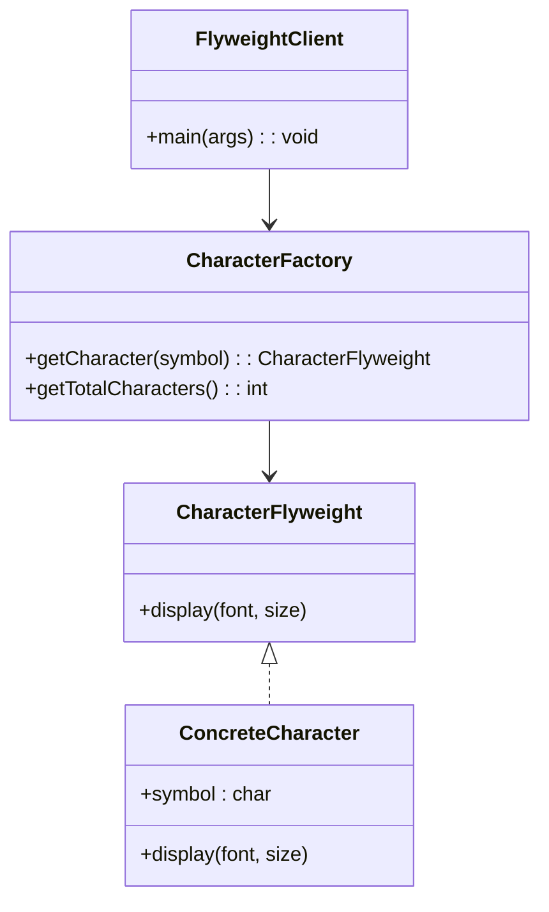

# Flyweight

## Intent
It allows you to fit more objects in RAM by sharing common parts of state between multiple objects instead of keeping all of the data in each object.

## Motivation
Consider a text editor example that allows users to type thousands of characters. If each character is represented as a separate object, memory consumption would be huge. Instead, we can share instances of characters, storing only the intrinsic properties (like the character itself) in a shared object, while extrinsic properties (like position or formatting) are handled externally.

For example, without Flyweight, we might have:

```java
public class Character {
    private char symbol;
    private String font;
    private int size;

    public Character(char symbol, String font, int size) {
        this.symbol = symbol;
        this.font = font;
        this.size = size;
    }
}
```

With Flyweight, we store only unique character objects and reuse them:

```java
public class CharacterFlyweight {
    private char symbol;

    public CharacterFlyweight(char symbol) {
        this.symbol = symbol;
    }
}

public class CharacterContext {
    private CharacterFlyweight flyweight;
    private String font;
    private int size;

    public CharacterContext(CharacterFlyweight flyweight, String font, int size) {
        this.flyweight = flyweight;
        this.font = font;
        this.size = size;
    }
}
```

## When to use
Use Flyweight when:

* You need to manage a large number of similar objects efficiently.
    * **Example:** A text editor that needs to store thousands of character objects.
* The cost of creating new objects is high, and many objects share the same data.
    * **Example:** Caching icons in a graphical application instead of creating duplicates.

## Structure


## Pros and Cons

| ✅ Pros                                    | ❌ Cons                                      |
|--------------------------------------------|---------------------------------------------|
| **Reduces memory usage**: By reusing objects, it minimizes unnecessary allocations. | **Increased complexity**: Managing shared objects requires additional logic. |
| **Improves performance**: Less memory allocation means better performance in memory-constrained environments. | **Not always beneficial**: If objects have many unique attributes, Flyweight may not be useful. |
| **Decouples data**: Separates intrinsic and extrinsic states, leading to better organization. | **Harder debugging**: Shared objects can lead to unintended side effects if modified incorrectly. |

## How to implement

1. Identify shared data: Determine what can be stored in a shared flyweight object and what should remain external.
2. Create a Flyweight interface: Define an interface that all flyweight objects must implement.
3. Implement Concrete Flyweights: Create classes that store intrinsic state and implement shared behavior.
4. Build a Flyweight Factory: Implement a factory to manage and return flyweight instances.
5. Use flyweights in the client code: Replace multiple object instances with shared flyweights where appropriate.