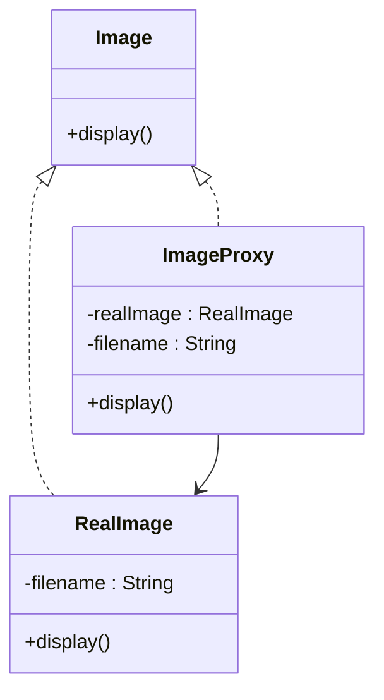

# Proxy

## Intent
To provide a surrogate or placeholder for another object to control access to it.

## Motivation
Consider an image viewer application that loads and displays high-resolution images. If each image is loaded immediately upon creation, it can lead to high memory consumption and slow performance. Instead, we can use a proxy that loads the image only when it is actually needed.

For example, without Proxy, we might have:

```java
public class RealImage {
    private String filename;

    public RealImage(String filename) {
        this.filename = filename;
        loadImageFromDisk();
    }

    private void loadImageFromDisk() {
        System.out.println("Loading image: " + filename);
    }

    public void display() {
        System.out.println("Displaying image: " + filename);
    }
}
```

## When to use
Use Proxy when:
* You need to control access to an object and add an extra level of indirection.
  * **Example**: A virtual proxy that loads an image only when needed.
* You want to add additional functionality without modifying the actual object.
  * **Example**: A protection proxy that restricts access to certain operations.

## Structure


## Participants
* **Proxy** (`ImageProxy`): Controls access to the real object and manages its lifecycle, such as lazy initialization.
* **Real Subject** (`RealImage`): The actual object that performs the real work, like loading and displaying an image.
* **Subject Interface** (`Image`): Defines the common operations shared by both the proxy and the real object, ensuring they can be used interchangeably by clients.

## Pros and Cons

| ✅ Pros                                    | ❌ Cons                                      |
|--------------------------------------------|---------------------------------------------|
| **Lazy initialization**: Loads heavy objects only when needed, improving performance. | **Adds complexity**: Introduces an additional layer that may be unnecessary in simple cases. |
| **Access control**: Restricts or manages access to sensitive objects. | **May introduce latency**: If the real object takes time to initialize, the proxy might delay execution. |
| **Logging and monitoring**: Can track operations performed on the real object. | **Can be misused**: If overused, proxies can make the system harder to understand. |

## How to implement

1. **Create an interface**: Define the common operations shared by the real object and the proxy.

2. **Implement the real object**: Create the class that performs the actual work.

3. **Create the proxy class**: Implement the interface while controlling access to the real object.

4. **Use the proxy instead of the real object**: Ensure client code interacts with the proxy, which manages the real object transparently.
